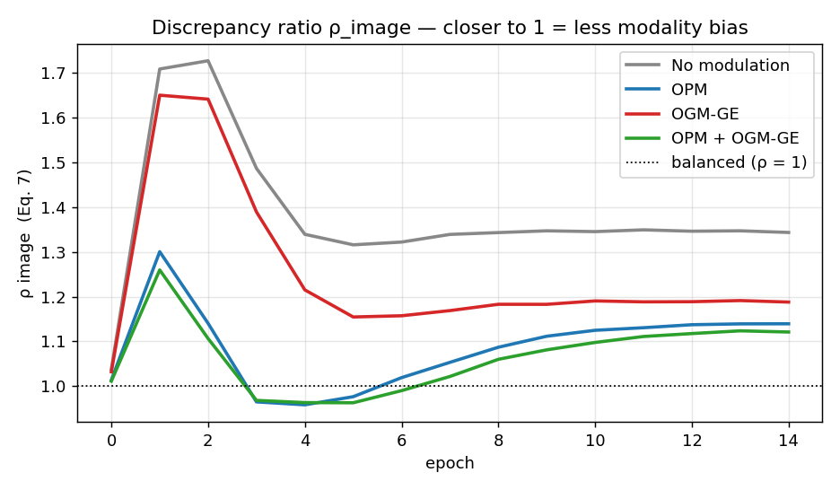

# Synthetic benchmark — results

_Auto-generated by `python scripts/make_report.py`; do not edit by hand._

## Protocol

- data: `synthetic` — 2400 train / 600 val, 6 classes, text informative w.p. p=0.7, image informative w.p. p=0.7
- model: `smallcnn` + 2-layer Transformer text encoder, late fusion (linear head)
- optim: SGD lr=0.01 momentum=0.9 · 15 epochs · batch 32 · 3 seeds per method

## Fusion methods — mean ± std over seeds

| modulation | seeds | best val acc | last-3-epoch val acc | ρ_image (final) | ρ_text (final) |
|---|---|---|---|---|---|
| No modulation | [0, 1, 2] | **0.887 ± 0.022** | 0.884 ± 0.021 | 1.344 ± 0.126 | 0.759 ± 0.075 |
| OPM | [0, 1, 2] | **0.904 ± 0.023** | 0.901 ± 0.022 | 1.140 ± 0.003 | 0.886 ± 0.003 |
| OGM-GE | [0, 1, 2] | **0.898 ± 0.017** | 0.894 ± 0.018 | 1.188 ± 0.065 | 0.855 ± 0.050 |
| OPM + OGM-GE | [0, 1, 2] | **0.906 ± 0.025** | 0.903 ± 0.025 | 1.121 ± 0.008 | 0.901 ± 0.006 |

## Uni-modal baselines (single run)

| baseline | best val acc | final uni acc |
|---|---|---|
| image-only | **0.715** | 0.715 |
| text-only | **0.738** | 0.733 |

## Per-run detail

| run | seed | modulation | best acc | best epoch | final ρ_image |
|---|---|---|---|---|---|
| `syn_none` | 0 | none | 0.885 | 13 | 1.44 |
| `sweep_s1_none` | 1 | none | 0.915 | 11 | 1.42 |
| `sweep_s2_none` | 2 | none | 0.860 | 12 | 1.17 |
| `syn_opm` | 0 | opm | 0.905 | 14 | 1.14 |
| `sweep_s1_opm` | 1 | opm | 0.932 | 13 | 1.14 |
| `sweep_s2_opm` | 2 | opm | 0.875 | 12 | 1.14 |
| `syn_ogm` | 0 | ogm | 0.898 | 13 | 1.24 |
| `sweep_s1_ogm` | 1 | ogm | 0.918 | 11 | 1.22 |
| `sweep_s2_ogm` | 2 | ogm | 0.877 | 11 | 1.10 |
| `syn_both` | 0 | both | 0.908 | 14 | 1.13 |
| `sweep_s1_both` | 1 | both | 0.935 | 13 | 1.12 |
| `sweep_s2_both` | 2 | both | 0.875 | 13 | 1.11 |

## Figures

Stress test (`--syn_synonyms 6`, severe text imbalance): none ρ_image 4.8 → OPM 2.3 (uni_text 0.25 → 0.31) — modulation always reduces the gap, even when the weaker modality is too hard to rescue fully.
